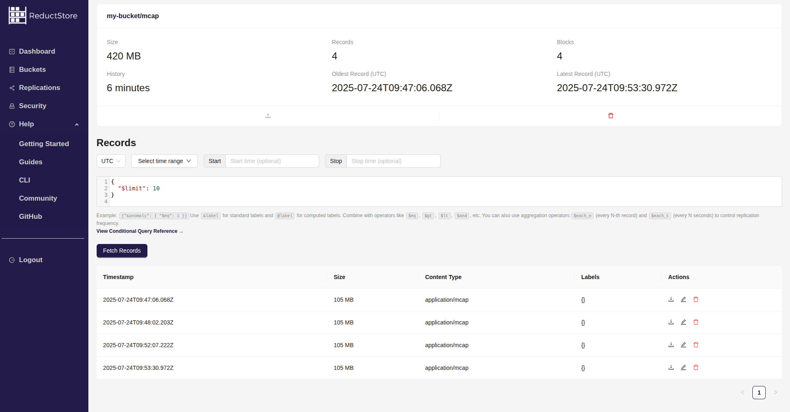

# Reduct Web Console

Web console for [ReductStore](https://www.reduct.store) based on React.js and Ant Design

## Features

- Embedded to ReductStore
- Bucket Management
- Data Browsing
- Token authentication

## Demo

You can explore it by using a demo server at [play.reduct.store](https://play.reduct.store).
The API token is `reductstore`.
